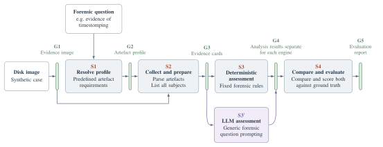

# FMBenchmark

The code of the framework and the image generator from the paper *Can LLMs Spot Anti-Forensics? A Modular
Framework for Benchmarking Large Language Models in Disk Forensics*.



*Figure 1 of the paper.* A forensic question, each targeting one anti-forensic technique, selects the
artefacts collected from a disk image and prepared as shared evidence cards. A deterministic engine (S3)
and an LLM (S3′) receive the same case input and produce independent predictions; neither sees the other's
output or the ground truth. Their result sets are compared and scored against ground truth. **S** labels
processing stages, **G** labels data interfaces.

## Architecture

The code follows Figure 1. `src/fmb/pipeline` runs the stages S1 to S4 for one case and writes each data
interface G1 to G5 as a JSON file; every stage reads only the interfaces before it.

| Figure 1 | | Code |
|---|---|---|
| Disk image | A synthetic Windows 11 NTFS case and its recorded ground truth | `src/fmb/generation` |
| G1 | Evidence image | |
| S1 | Resolve profile: the question's artefact families, collection targets and parser outputs | `src/fmb/profiles.py`, `src/fmb/question_packs.py` |
| G2 | Artefact profile | |
| S2 | Collect and prepare: parse the artefacts, list all subjects, cut one evidence card per subject | `src/fmb/collection`, `src/fmb/index`, `src/fmb/preparation` |
| G3 | Evidence cards | |
| S3 | Deterministic assessment with fixed forensic rules | `src/fmb/assessment`, `src/fmb/analysis` |
| S3′ | LLM assessment of the same cards with the generic forensic question | `src/fmb/assessment/llm.py`, `src/fmb/interpretation` |
| G4 | Result sets, separate for each engine | |
| S4 | Compare and score both against ground truth | `src/fmb/evaluation` |
| G5 | Evaluation report | |

The generator freezes a recipe for each paper image (I1, I2, I3), boots a Windows guest from a base image,
plays the scenario's activity and anti-forensic techniques through Ansible
(`src/fmb/generation/ansible`) and exports the disk image with its ground truth. The paper's guest is
Windows 11 ARM64 under VMware Fusion (`tools/base-image/windows11-arm64`); on Linux hosts the same guest
definition runs on QEMU with a Windows 11 x64 base built from Microsoft's ISO
(`tools/base-image/windows11-x64`). The question definitions, the protocol and the data contracts of every
interface are in `src/fmb/contracts`.

## Replicating the paper

`fmb replicate` generates I1, I2 and I3 on your machine, collects their evidence and runs S1 to S4 with
the deterministic engine. An image replicates when strict admission passes, which requires S3 to answer
all nine questions exactly. The LLM conditions are frozen but not dispatched, so no provider account is
needed.

| Host | Guest engine | Windows guest |
|---|---|---|
| macOS on Apple silicon | VMware Fusion through Vagrant, the paper's setup | Windows 11 ARM64, the paper's box |
| Linux x86-64 | QEMU with KVM | Windows 11 Pro x64, built from Microsoft's ISO |

Windows hosts are not supported yet: the base builds and the images generate under the Windows Hypervisor
Platform, but collecting their evidence still fails on a fresh machine.

### Requirements

- [uv](https://docs.astral.sh/uv/) and a clone of this repository;
- about 40 GB of free disk per image in flight, plus about 10 GB for the Windows base;
- internet access during setup.

On Linux, also Microsoft's Windows 11 ISO, which you download yourself (its links last a
day): on [microsoft.com/software-download/windows11](https://www.microsoft.com/software-download/windows11)
choose *Windows 11 (multi-edition ISO for x64 devices)*, then *English (United States)*. The file is
`Windows11_Client_x64_en-us_26300_9457.iso`, and setup checks its SHA-256. Microsoft offers only its
current build; for a newer one, add `--unpinned-iso` to setup, and every result records the build and the
ISO's SHA-256.

**Linux** (Debian or Ubuntu)

```bash
sudo apt-get update && sudo apt-get install qemu-system-x86 qemu-utils ovmf
```

On Fedora, `sudo dnf install qemu-system-x86-core qemu-img edk2-ovmf`; on Arch,
`sudo pacman -S qemu-system-x86 qemu-img edk2-ovmf`; on openSUSE,
`sudo zypper install qemu-x86 qemu-tools qemu-ovmf-x86_64`. Your user needs read-write access to
`/dev/kvm`: if it lacks it, run `sudo usermod -aG kvm $USER` and log in again.

**macOS**: VMware Fusion 13, Vagrant with the `vagrant-vmware-desktop` plugin, Ansible
(`brew install ansible`), and the paper's box, built with
`tools/base-image/windows11-arm64/build-vmware-box.sh`.

### Run

```bash
uv sync --locked --all-extras
uv run fmb replicate doctor
uv run fmb replicate setup --iso ~/Downloads/Windows11_Client_x64_en-us_26300_9457.iso
uv run fmb replicate run I1 I2 I3
```

- `doctor` checks the host and prints the command that fixes anything missing.
- `setup` installs the pinned .NET runtime, Ansible and collection tools under `~/.cache/fmb` (or
  `FMB_CACHE`). On Linux it also builds the Windows base from the ISO, once, in about 30 minutes. On macOS
  it takes no `--iso`.
- `run` writes each image to `replication/<image>/` and `replication/summary.json`, which lists per image
  the admission result, the number of exact questions and F1. An image takes about an hour. On Linux, the
  first image after a base build waits about 70 minutes before generating, until the guest's clock is past
  the base build's last events.

Generation retries a boot or provisioning failure with the same frozen recipe, up to `--attempts` times
(default 3). Images are never bit-identical: each frozen recipe draws a fresh random assignment. What
replicates is the protocol and the result.

## Your own images

Set the host up with `fmb replicate doctor` and `fmb replicate setup` first, then:

```bash
uv run fmb list                                         # images and LLM conditions
uv run fmb new myimage --from I3                        # writes images/myimage.json
uv run fmb run myimage --llm sonnet5-high --cap-usd 20  # generate, collect, analyse and score
```

`fmb run` with no image lists the choices and asks. It writes `runs/<image>/` and `runs/summary.json`.

**Images.** One file defines an image: a paper image's population plus a `seed`, saved as
`images/<name>.json`. `images/decoys.json` is I3 with twice as many untouched objects around the same
manipulations. In the file:

- `seed` picks the objects' names and folders and the virtual hardware;
- `scenarios` sets how many objects each anti-forensic technique creates (`configured_count`). Its guest
  script fixes how many of them it manipulates, so `manipulation_count` keeps the paper's value;
- `native_pilot_parameters.case_classes` picks each question's supplementary cases and controls, at most
  as many of each as I3 has.

`run` checks each file before it starts and says what does not fit. All fourteen scenarios stay; the USB,
NTFS-allocation and event-log scenarios also keep their number of objects. Which objects are manipulated is
drawn when the run freezes its recipe, so two runs of one file are the same population, not the same disk.

**Both assessments.** Every run assesses the evidence cards with the deterministic rules (S3) and freezes
the same cards as requests for the LLM (S3'). `--llm CONDITION` also sends them, three passes as in the
paper, and the summary scores S3 and S3' against ground truth. The conditions are the paper's eight;
`fmb list` shows each model and its recorded price. They need `OPENAI_API_KEY` or `OPENROUTER_API_KEY`.
`--cap-usd` is the most the LLM requests of one image may cost: the run sends nothing that could exceed
it. A condition without a recorded price also needs `--price CONDITION=INPUT,OUTPUT`, in US dollars per
million tokens. As in the paper, the LLM is asked only about images that pass admission.

### Changing the code

New techniques, questions or rules are code changes:

| To add | Change |
|---|---|
| A technique | Its Ansible task in `src/fmb/generation/ansible/roles/manipulation/tasks/`, its scenario in `SCENARIO_ANALYSIS` (`src/fmb/generation/population.py`) and in your population file, its definition in `src/fmb/analysis/catalog.py`, and its rule in `src/fmb/analysis/shared_rules.py` |
| A supplementary case | `CASE_CLASSES` in `src/fmb/generation/pilot_profile.py`, its construction in `src/fmb/generation/ansible/roles/manipulation/files/pilot_challenge.ps1`, and its expected answer in `src/fmb/evaluation/factual_reference.py` |
| A question | A question pack in `src/fmb/contracts/questions/`, `QIDS` in `src/fmb/core/case_contract.py`, and its rule; collection, preparation and evaluation assume the nine-question roster, so let the tests guide you |
| An S3 engine or a stage implementation | `ENGINES` in `src/fmb/assessment/stage.py`, or `IMPLEMENTATIONS` in `src/fmb/pipeline/implementations.py` |

The paper's images run with the released code only: `fmb run` and `fmb replicate run` stop before
generating one if any file differs. Your own images also run with changed code; `summary.json` lists the
changed files, and each image keeps a copy of the code it ran.

## Licence

MIT (`LICENSE`), except the `$LogFile` driver `tools/dfir_ntfs/fmb_logfile_records.py`, which is
GPL-3.0-or-later (`LICENSES/`). Third-party components are listed in `THIRD_PARTY_NOTICES.md`.
